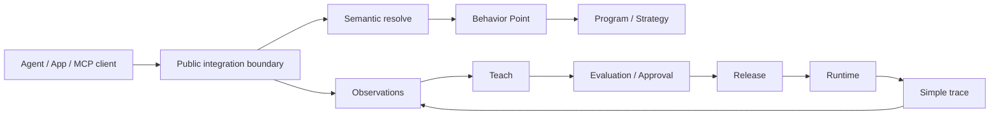

# Public architecture

```mermaid
flowchart LR
    A[Agent / App / MCP client] --> B[Public integration boundary]
    B --> C[Observations]
    B --> D[Semantic resolve]
    D --> E[Behavior Point]
    E --> F[Program / Strategy]
    C --> G[Teach]
    G --> H[Evaluation / Approval]
    H --> I[Release]
    I --> J[Runtime]
    J --> K[Simple trace]
    K --> C
```

## Scope of this diagram

This diagram describes the product-level integration flow. Deployment-specific architecture is documented in the environment where it is operated.
